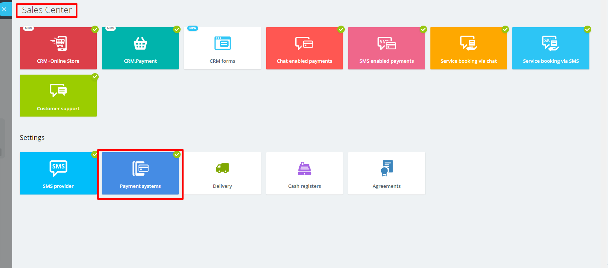
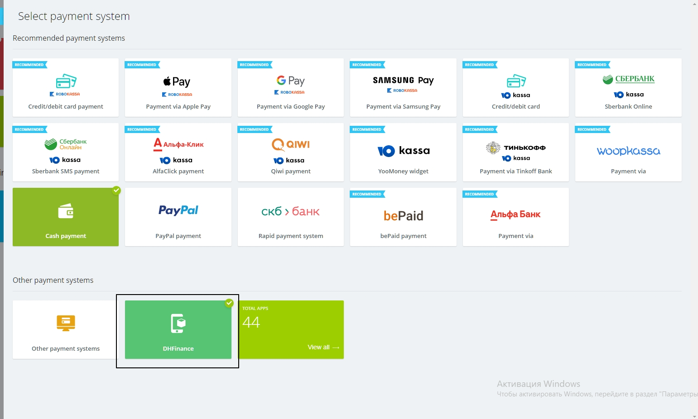
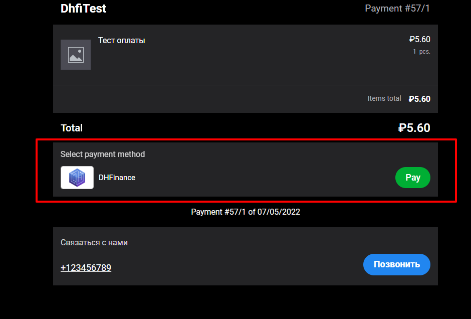

# Инструкция по установке и настройке

## Краткое описание установки и настройки

Алгоритм установки и настройки модуля после установки

1. **Алгоритм установки, если модуль не опубликован на маркетплейс:**  
   
   `http://<адрес сайта>/bitrix/admin/update_system_partner.php?addmodule=<код модуля>`:  
   * <Адрес сайта> - домен портала Битрикс24;  
   * <Код модуля> - `citrus.dhfi`;
  
   Пример ссылки с кодом модуля: `http://<адрес сайта>/bitrix/admin/update_system_partner.php?addmodule=citrus.dhfi`;

2. **Клиент** устанавливает модуль на **Б24 Коробку из маркетплейса Битрикс управление сайтом**:
   - Валюта **CSPR** создается автоматически.  
     Курсом валюты CSPR можно управлять в настройках модуля [Валюты](https://training.bitrix24.com/support/training/course/index.php?COURSE_ID=178&LESSON_ID=23084&LESSON_PATH=17520.18658.4245.1143.23084);

   - **Для старой версии счетов Клиент** создает и настраивает платежную систему для плательщиков:
     * Инструкция по настройке описана в [официальной документации Битрикс24](https://helpdesk.bitrix24.com/open/5872347/);
     * Переходим в 

CRM → More → Settings → CRM Settings

     * Выбираем 

Payment option → Payment systems

     * Кликаем *Create payment system*;
     * В форме создания платежной системы заполняем поля:
       * *Name* - `DHFinance`;
       * *Handler* - Выбираем `DHFinance (dhfi)`;
       * *Active* - проставляем чекбокс;
       * *Client type* - потребуется создание 2 платежных систем, которые будут отличаться выбором данного свойства, для одной выбираем *Contact*, для второй *Company*;
       * *API key* - заполняем API key магазина от сервиса DHFI;
       * *DHFI api server* - заполняем адрес сервиса взаимодействия API;
     * Требуется создать *2 платежные системы* в зависимости от типа плательщиков для выставления счетов:
       * Платежная система для *Контактов*;
       * Платежная система для *Компаний*;
     * Данная настройка используется для старой версии счетов;
     * 

Пример формы заполнения платежной системы

   - **Для новой версии счетов: Клиент** создает и настраивает способ оплаты в разделе “Sales center” портала:
     * Инструкция по настройке с детальным описанием в [официальной документации Битрикс24](https://helpdesk.bitrix24.com/open/9613777/);
     * 

Клиент переходит в раздел “Sales center” и кликает на “Payment systems”

     * 

Выбирает в подразделе “Other payment system” систему “DHFinance”

     * Заполняет настройки для подключения способа оплаты;
     * Сохраняет изменения;
3. Проводит необходимые настройки для обмена данными по API: в настройках платежной системы указывается ID магазина и ключ API из [pay.dhfi.online](https://pay.dhfi.online/)

4. Платежная система DHFI после активации и корректной настройки отображается в зависимости от выбранных настроек в:
   
   * Публичная страница счета на оплату (Иллюстрация 2):
   * Способы оплаты в Магазине **Б24 Коробки** на странице сайта (Иллюстрация 3).

## Детальное описание алгоритма создания, отправки и проведения оплаты

* Видео примеры использования модуля для выставления счетов:
  * [Old invoices](https://user-images.githubusercontent.com/444489/178686899-9e67a3fe-945b-487a-8ce9-e5a84f961aab.webm)
  * [Sales in sms (Receive payment)](https://user-images.githubusercontent.com/444489/178687137-21a84b67-55dd-44a2-844a-5ce234c4edd0.webm)
* После создания счета **Клиентом** на **Б24 Коробке** публичная ссылка на оплату счета отправляется покупателю по выбранному каналу связи;
* Покупатель открывает полученную ссылку счета для выбора способа и проведения оплаты;
* В блоке “Pay Using” отображается иконка и название способа оплаты **Модуля** - “DHFinance”;
* Покупатель на странице счета на оплату выбирает платежную систему “DHFinance” и кликает на “Pay” или на иконку платежной системы:
  * Зависит от выбранного типа счета;
* Модуль отправляет данные запрос с параметрами на сторону платежной системы “DHFI”
  * В параметры записываются из **Б24 Коробки**:
    * Сумма платежа;
    * Уникальный идентификатор счета;
* Портал получает по API от сервиса готовую сформированную ссылку на оплату;
* Покупателя адресует на страницу оплаты, ссылку на которую портал получил в качестве ответа на запрос с параметрами и описанием выше;
* Покупатель производит оплату на стороне DHFI;
* DHFI передает после оплаты на портал информацию об оплате счета в CSPR на стороне DHFI;
* Статус выставленного счета в случае получения информации об оплате от DHFI меняется на “Close invoice”.

## Иллюстрации

Иллюстрация 1 - Пример заполнения формы платежной системы для старых счетов

Иллюстрация 2 - Публичная страница счета (Старая версия счета)

Иллюстрация 3 - Публичная страница оплаты (Новая версия счетов - продажи в чатах)

# Сквозное тестирование

Для работы нужен NodeJS LTS с npm 8.12.

## Установка:
В папке tests
1. Скопировать `.env.example` в `.env`,
2. Указать в `.env` URL тестового Битрикс24, логин и пароль администратора,
3. Выполнить `npm install`

## Необходимые настройки Битрикс24 для запуска тестов

- Создать «CRM + Интернет-магазин» в разделе «Магазин»
- Настроить провайдер SMS. Без этого не даёт сгенерировать ссылку на оплату,
- Настроить способы оплаты для старых и новых счетов: для контактов и для компаний,
- Способ оплаты должен называться «DHFinance», на страницах оплаты тесты ориентируются на это название.

## Запуск
В папке tests
- `npm run codeceptjs` или `npm run codeceptjs:ui`
- `npm run codeceptjs:headless` если окно браузера показывать не нужно

