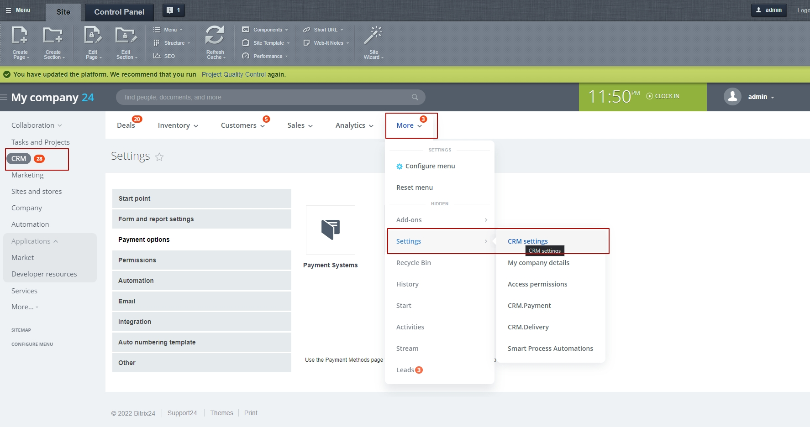
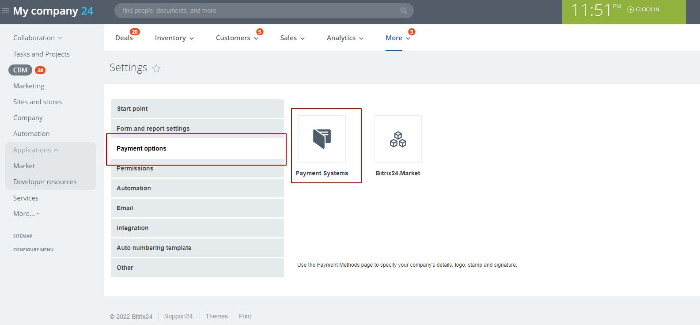
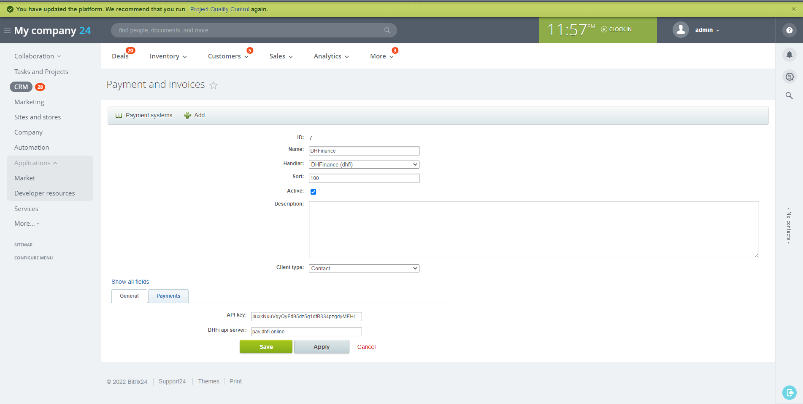
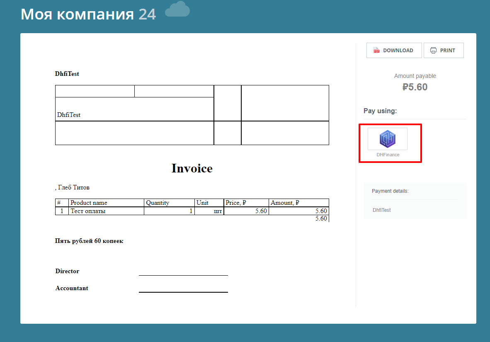

# Installation and configuration instructions
* We have installed Bitrix24 last version here http://tsaritnp.beget.tech. So you can test installation and functions.
* To get the account for testing, please contact via telegram: huytran2017
## Brief description on installation and configuration 

The algorithm for installing and configuring the module after installation

1. **If module is not published on the marketplace, installation algorithm :** 
* Type the following address into your browser `http://<website address>/bitrix/admin/update_system_partner.php?addmodule=<module code>`: 
    * website address – domen of Bitrix24 portal; 
    * module code - `citrus.dhfi`;
* Example link with module code: `http://<website address>/bitrix/admin/update_system_partner.php?addmodule=citrus.dhfi`;

2. **If module was published on the marketplace, Client installs module on Bitrix24 from the marketplace :**
- **For the all version of accounts Client** creates and configures payment system for payers:
* Configuration manual is desrcibed in [Bitrix24 official documentation](https://helpdesk.bitrix24.com/open/5872347/);
* Go to 

CRM → More → Settings → CRM Settings

* Choose 

Payment option → Payment systems

* Click on  *Create payment system*;
* In the form of creation of the payment system we fill in the lines:
* *Name* - `DHFinance`;
* *Handler* – Choose `DHFinance (dhfi)`;
 * *Active* – put in checkbox;
* *Client type* – creation of 2 payment systems is required, which will be specified by choosing the given feature, for one we choose *Contact*, for the second *Company*;
* *API key* – fill in the shop API key from DHFI service;
* *DHFI api server* – fill in the address of the API interaction service;
* Is required to create *2 payment systems* depending on the type of payers to whom the invoicing is made:
* Payment system for *Contacts*;
* Payment system for *Companies*;
* The given configuration is used for the all version of accounts;
* 

Example if filling in the form of payment system

3. Performs the necessary settings for data exchange via the API: in the payment system settings should be indicated the shop ID and API key from  [pay.dhfi.online](https://pay.dhfi.online/)

4. Payment system DHFI, after activation and correct configuration, is shown in the Public page of the invoice (Illustration 2).

## Detailed description of the algorhythm of creation, sending and processing of the payment 

* Video examples of using the invoicing module: [Invoices](https://user-images.githubusercontent.com/444489/178686899-9e67a3fe-945b-487a-8ce9-e5a84f961aab.webm)
* After the  **Client** has made an invoice on **Bitrix24** , the public link of an invoice is send to the customer via the choosen communication channel;
* The customer opens a given invoice link to choose the payment method and proceeding the payment;
* In a block “Pay Using” we can see an icon and the name of the payment method of **Module** - “DHFinance”;
* On the invoice page the customer chooses the payment system “DHFinance” and clicks on “Pay” or the icon of the payment system;
* Module sends data request with the parameters to the side of the payment system “DHFI”
* Parameters are filled in from **Bitrix24**: Sum of the payment; Unique account identificator;
* The portal receives via API the ready-made formed link to the invoice;
* The customer is addressed to the page of the payment, a link to which the portal has received as the answer to the request of the parameters mentioned and described above;
* The customer proceeds payment on the side of DHFI;
* DHFI, after the payment is received, sends to the portal the information on the completed invoice via CSPR on the DHFI;
* Status of the invoice in the case of received data of the payment from DHFI, is changed to “Close invoice”.

## Illustrations

 Illustraton 1 – Example of filling in the form of the payment system 

Illustration 2 – Public page of the invoice 

# End-to-end testing

 NodeJS LTS with npm 8.12. Is required for work

## Installation:
1. Copy `.env.example` to `.env`,
2. Specify test Bitrix24 URL, admin login and password in `.env` file,
3. Proceed `npm install`

## Required settings of Bitrix24 for running tests

- Create «CRM + Internet-shop» in the «Shop» section
- Configure the SMS provider. Without it, a link to the payment can’t be generated,
- Set payment methods for the accounts: for contacts and for companies,
- Payment method should be called «DHFinance», on the payment pages tests are oriented to that name.

## Running

- `npm run codeceptjs`: runs tests in console with visible browser window. Test results are output to the console upon competition.
- `npm run codeceptjs:ui`: opens UI to run all or seperate tests in browser window. Test results are in UI, click on a particular test to see its results in depth.  
- `npm run codeceptjs:headless` runs tests in console only with no browser window. Test results are output to the console upon competition. 
